# Project6 메모모
## 프로젝트 개요
- 팀원 : 김보경(팀장), 한선, 최상민 (3인)
- 개발 기간 : 2023년 11월 27일 ~ 12월 26일 (약 1달)
- BackEnd : Spring Boot, Java, Spring JPA
- FrontEnd : HTML, CSS, Thymeleaf, JavaScript, JQuery
- Database :  Maria DB

## 👋팀원 소개
- 팀 이름: 꼬부기 팀
- 팀장 [김보경](https://github.com/emssme): 게시판, 포스트, 상세보기, 댓글, 격자형 레이아웃
- [최상민](https://github.com/sangmin0816): 포스트 웹소켓, 타임라인 레이아웃, 좋아요
- [한선](https://github.com/hansun321): 회원기능, 비회원 입장, 게시판 내보내기

## 💻기술 스택
#### ✅FRONTEND :     
#### ✅BACKEND :  
#### ✅DATABASE : 
#### ✅Server : 

---
## 📝프로젝트 설계

### UCD
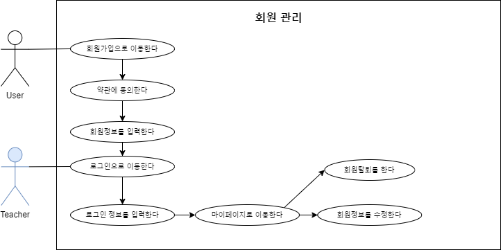
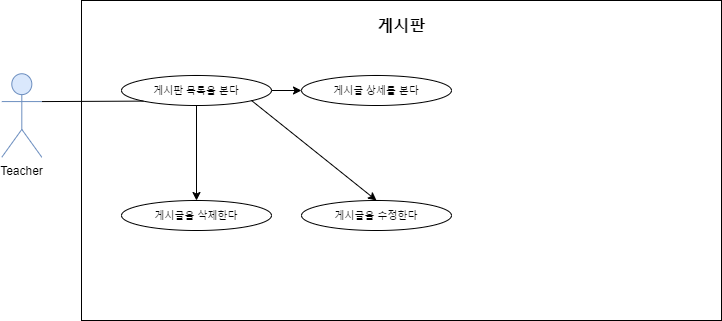
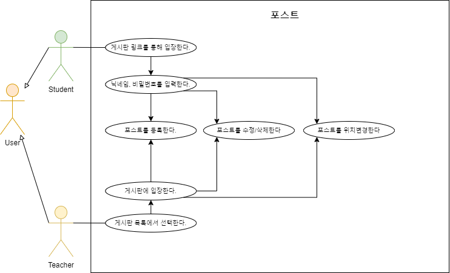

### ERD
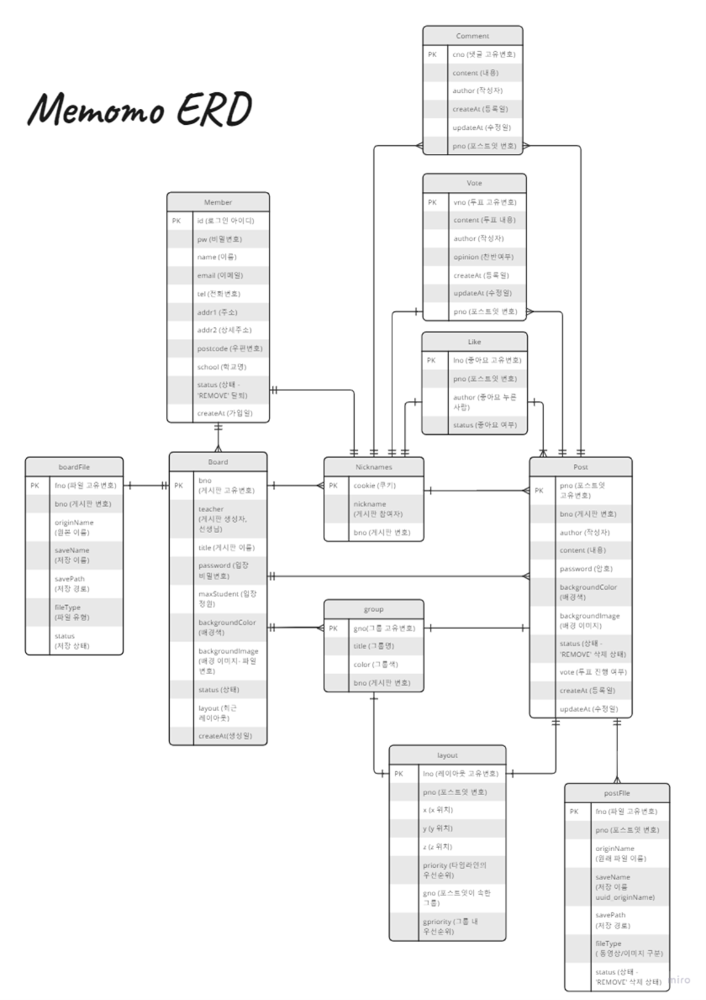

### 클래스 다이어그램
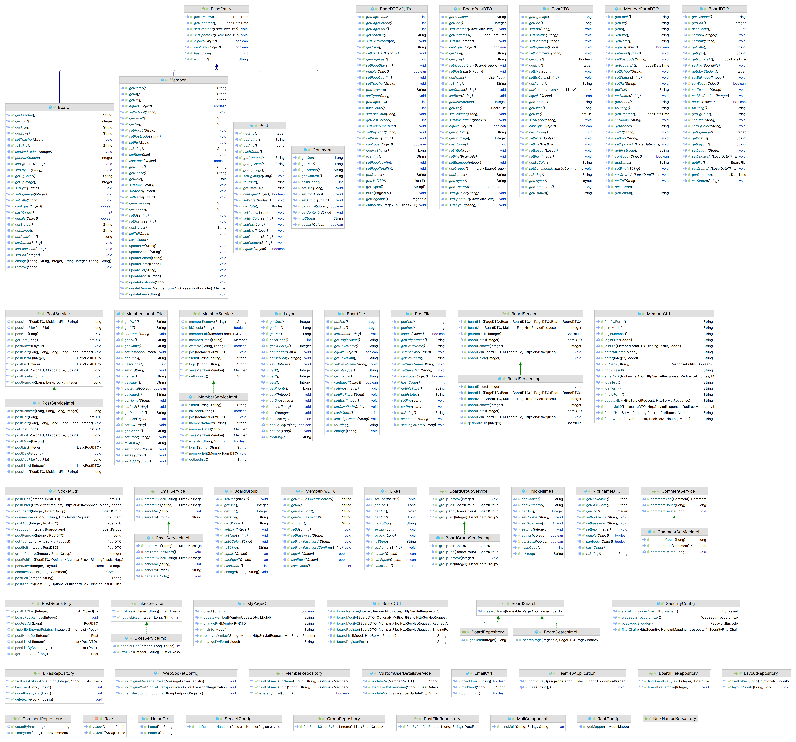
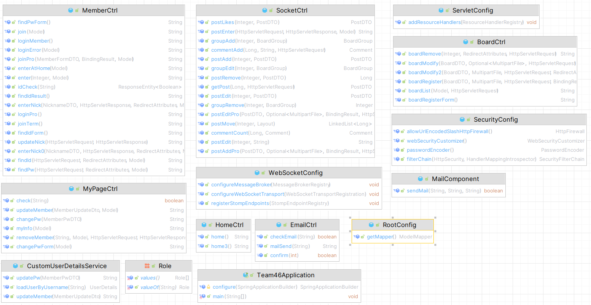
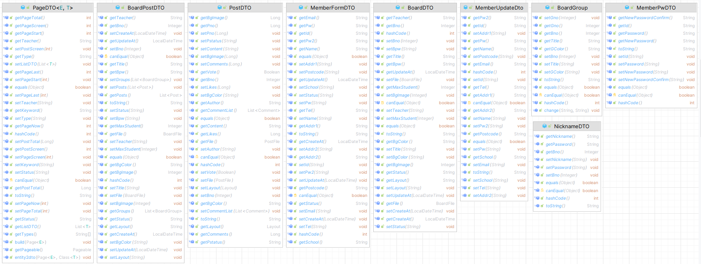
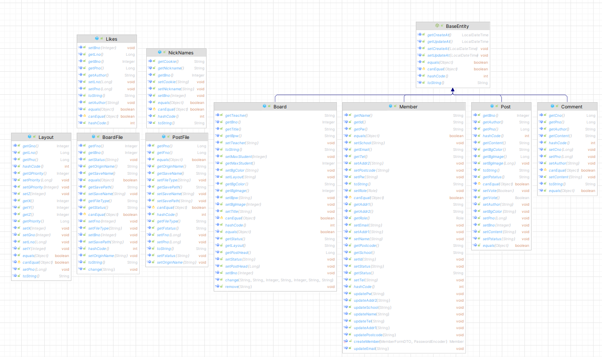
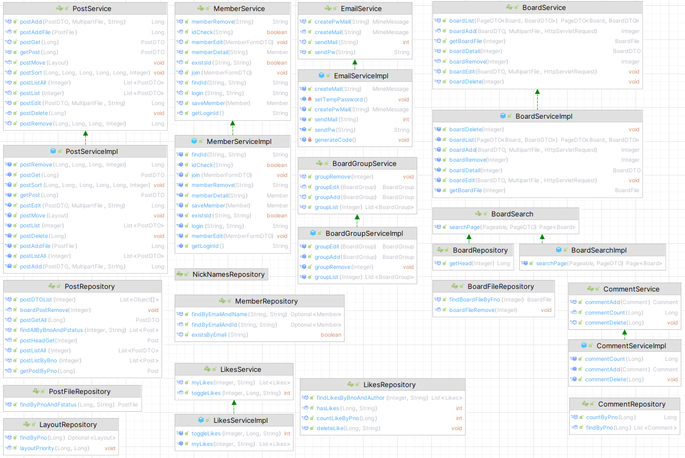

### 시퀀스 다이어그램
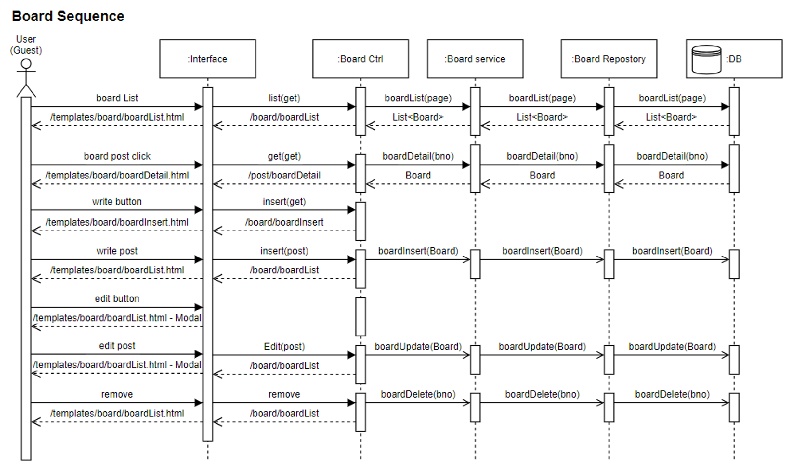
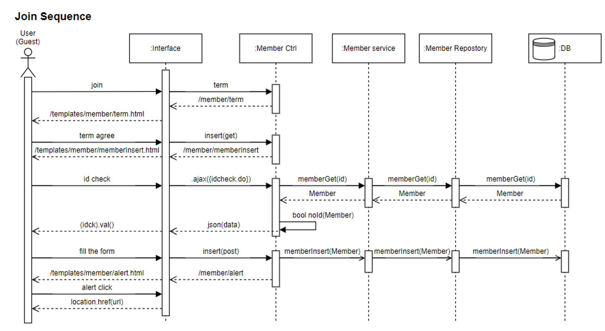
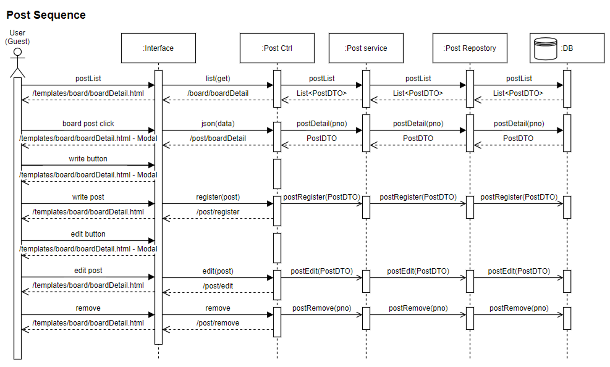

## 🎥 시연 영상
